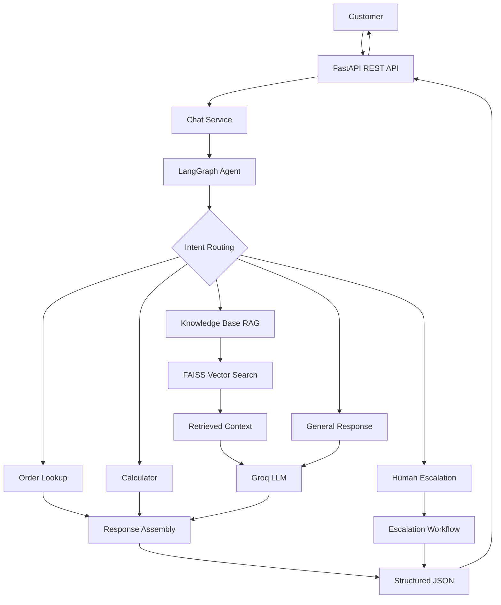

# AI Customer Support Agent 🤖

### Intelligent Customer Support Powered by Generative AI

An AI-powered customer support platform designed to automate customer interactions, deliver accurate answers from a knowledge base, retrieve order information, perform calculations, and escalate complex issues to human support.

Built with **Python, FastAPI, LangChain, LangGraph, Groq, and FAISS**, the system combines intelligent query routing with Retrieval-Augmented Generation (RAG) to provide contextual, structured, and efficient customer support through a REST API.

[Features](#-key-features) · [Architecture](#-system-architecture) · [Installation](#-getting-started) · [API](#-api-reference) · [Roadmap](#-roadmap)

---

## 🚀 Overview

Modern businesses receive repetitive customer inquiries about products, shipping, returns, order status, and general support. Handling every request manually can increase response times and operational costs.

The AI Customer Support Agent addresses this challenge by intelligently identifying customer intent and selecting the appropriate response workflow.

Instead of relying exclusively on generic LLM responses, the system can retrieve relevant information from a local knowledge base, invoke specialized tools, and identify situations that require human intervention.

### What the system can do

- Answer frequently asked questions using company documentation.
- Retrieve relevant product and support information through semantic search.
- Check order status and estimated delivery using an order lookup tool.
- Perform calculations when required.
- Maintain conversational context when session history is configured.
- Flag unresolved queries for human assistance.
- Return consistent, structured JSON responses through a REST API.

## ✨ Key Features

| Feature | Description |
|---|---|
| 🧠 Intelligent Routing | Directs customer queries to the appropriate handler based on intent. |
| 📚 Knowledge-Based Answers | Uses RAG to generate answers grounded in retrieved support documentation. |
| 🔎 Semantic Search | Uses FAISS and text embeddings to find relevant knowledge-base content. |
| 📦 Order Tracking | Retrieves order status and delivery estimates from the configured order data source. |
| 🧮 Calculator Tool | Handles supported mathematical queries through a dedicated tool. |
| 🙋 Human Escalation | Identifies requests that require human support. |
| 💬 Conversation Management | Provides a foundation for storing conversations and message history. |
| ⚡ REST API | Exposes customer-support functionality through FastAPI endpoints. |
| 🛡️ Data Validation | Uses Pydantic schemas for structured request and response handling. |
| 🧪 Automated Testing | Supports regression testing with Pytest and code-quality checks with Ruff. |

## 🏗️ System Architecture

The application follows a modular architecture that separates API endpoints, agent orchestration, business logic, retrieval, and data persistence.



### How it works

1. **Receive:** The API accepts a customer message.
2. **Understand:** The agent analyzes the query and identifies its intent.
3. **Route:** LangGraph directs the request to the appropriate handler.
4. **Retrieve or execute:** The selected handler searches the knowledge base, checks order information, performs a calculation, or generates a general response.
5. **Generate:** The language model prepares a context-aware response when required.
6. **Escalate:** Requests that cannot be adequately resolved can be flagged for human intervention.
7. **Return:** The API returns a validated JSON response with the answer and relevant metadata.

## 🛠️ Technology Stack

| Technology | Role |
|---|---|
| Python 3.11+ | Application development |
| FastAPI | High-performance API framework |
| LangChain | LLM integration, retrieval, and tool abstractions |
| LangGraph | Stateful agent orchestration and conditional routing |
| Groq | Language model inference |
| FAISS | Local vector similarity search |
| Sentence Transformers | Semantic text embeddings |
| Pydantic | Data validation and response schemas |
| SQLAlchemy | Database ORM foundation, if configured |
| Alembic | Database schema migrations, if configured |
| Pytest | Automated testing |
| Ruff | Linting and code quality |

## 📂 Project Structure

```text
ai-customer-support/
├── app/
│   ├── api/
│   │   ├── router.py
│   │   └── endpoints/
│   │       ├── health.py
│   │       ├── chat.py
│   │       ├── conversations.py
│   │       ├── orders.py
│   │       └── escalation.py
│   ├── core/
│   │   ├── config.py
│   │   ├── logging.py
│   │   └── security.py
│   ├── schemas/
│   │   ├── chat.py
│   │   ├── conversation.py
│   │   ├── order.py
│   │   └── escalation.py
│   ├── services/
│   │   ├── chat_service.py
│   │   ├── conversation_service.py
│   │   ├── order_service.py
│   │   └── escalation_service.py
│   ├── agents/
│   │   ├── graph.py
│   │   ├── state.py
│   │   ├── nodes.py
│   │   ├── routing.py
│   │   └── prompts.py
│   ├── rag/
│   │   ├── ingestion.py
│   │   ├── chunking.py
│   │   ├── embeddings.py
│   │   └── retriever.py
│   ├── tools/
│   │   ├── calculator.py
│   │   └── order_lookup.py
│   ├── db/
│   │   ├── session.py
│   │   ├── base.py
│   │   ├── models/
│   │   └── repositories/
│   ├── frontend/
│   │   ├── templates/
│   │   └── static/
│   └── main.py
├── data/
│   ├── knowledge_base/
│   └── vector_store/
├── tests/
├── scripts/
├── migrations/
├── .env.example
├── .gitignore
├── alembic.ini
├── Dockerfile
├── docker-compose.yml
├── pyproject.toml
└── README.md
```

*Note: This structure represents the planned application layout. Features and integrations depend on the corresponding modules being implemented and configured.*

## ⚙️ Getting Started

### Prerequisites

Before you begin, make sure you have:

- Python 3.11 or newer
- A valid Groq API key
- Git
- Internet access for package installation and the initial embedding-model download

### 1. Clone the repository

```bash
git clone <your-repository-url>
cd ai-customer-support
```

Replace `<your-repository-url>` with your Git repository URL.

### 2. Create a virtual environment

**Windows PowerShell**

```powershell
py -3.11 -m venv .venv
.\.venv\Scripts\Activate.ps1
```

**macOS / Linux**

```bash
python3.11 -m venv .venv
source .venv/bin/activate
```

### 3. Install dependencies

```bash
python -m pip install --upgrade pip
python -m pip install -e ".[dev]"
```

### 4. Configure environment variables

Create a `.env` file in the project root using `.env.example` as a reference.

```dotenv
GROQ_API_KEY=your_groq_api_key
GROQ_MODEL=openai/gpt-oss-120b
DATABASE_URL=sqlite:///./data/customer_support.db
```

`GROQ_MODEL` and `DATABASE_URL` are optional. The database defaults to a local SQLite file at `data/customer_support.db`. Set `DATABASE_URL` to a SQLAlchemy URL to use another supported database, such as PostgreSQL.

**Security:** Never commit `.env` files or API credentials. Keep secrets out of source code, logs, and API responses.

### 5. Prepare the knowledge base

Add your FAQ and support documentation as `.txt` files under:

```text
data/knowledge_base/
```

Example document:

```text
Shipping and Delivery Policy

Standard shipping generally takes 3-5 business days.
Customers can request order-status information using their order ID.
Delivery estimates may vary based on destination and carrier availability.
Contact customer support for assistance with delayed shipments.
```

Generate the vector index:

```bash
python -m scripts.ingest_knowledge_base
```

The ingestion process prepares document embeddings and saves the FAISS index under `data/vector_store/`.

Run ingestion again whenever you add or update knowledge-base documents.

### 6. Start the application

```bash
uvicorn app.main:app --reload --reload-dir app
```

Once the server starts, open the API documentation in your browser.

| Resource | URL |
|---|---|
| API Base URL | http://127.0.0.1:8000 |
| Interactive Swagger Docs | http://127.0.0.1:8000/docs |
| ReDoc Documentation | http://127.0.0.1:8000/redoc |
| Health Endpoint | http://127.0.0.1:8000/api/v1/health |

## 🔌 API Reference

### Health Check

`GET /api/v1/health`

Checks the application's health endpoint.

```bash
curl http://127.0.0.1:8000/api/v1/health
```

### Chat Endpoint

`POST /api/v1/chat`

Accepts a customer message and returns a structured support response.

**Request body**

```json
{
  "message": "Can you check order ORD-1001?"
}
```

**Example response**

```json
{
  "intent": "order_status",
  "reply": "Demo order ORD-1001 is currently shipped. Estimated delivery: 2026-10-12.",
  "confidence": 1.0,
  "sources": [],
  "needs_human": false,
  "escalation_reason": null,
  "conversation_id": "e70e8418-d882-4fd9-9e65-3fedfc7f4274"
}
```

The API creates a conversation for the first message and returns its ID. Include that ID with subsequent messages to append them to the same conversation:

```json
{
  "message": "And when should it arrive?",
  "conversation_id": "e70e8418-d882-4fd9-9e65-3fedfc7f4274"
}
```

Retrieve the persisted conversation and its messages with `GET /api/v1/conversations/{conversation_id}`. This endpoint returns stored history; the current agent does not yet automatically include prior turns as model context.

### Response fields

| Field | Description |
|---|---|
| `intent` | Detected customer-query category |
| `reply` | Customer-facing answer |
| `confidence` | Application-provided confidence score |
| `sources` | References to supporting knowledge sources |
| `needs_human` | Indicates whether human assistance is required |
| `escalation_reason` | Explanation for escalation, or `null` |

### Example API request

```bash
curl -X POST "http://127.0.0.1:8000/api/v1/chat" \
  -H "Content-Type: application/json" \
  -d '{"message":"What is your return policy?"}'
```

### Additional endpoint modules

The project structure also provides modules for conversation management, order queries, and escalation:

| Endpoint area | Intended responsibility |
|---|---|
| `/api/v1/health` | Application health |
| `/api/v1/chat` | Customer messages and AI responses |
| `/api/v1/conversations/{conversation_id}` | Persisted conversation and message history |
| `/api/v1/orders` | Order information |
| `/api/v1/escalation` | Escalation requests and support tickets |

Order and escalation endpoint modules are not currently registered in the API router.

## 📚 Retrieval-Augmented Generation (RAG)

The RAG pipeline allows the agent to answer customer questions using relevant company documentation rather than relying only on the model's general knowledge.

**Retrieval pipeline:**

1. Load source documents from the knowledge-base directory.
2. Split documents into manageable chunks.
3. Generate vector embeddings.
4. Store the vectors in FAISS.
5. Retrieve relevant chunks for a customer query.
6. Pass the retrieved context to the language model.
7. Generate an answer grounded in the available information.

This design can improve answer relevance and makes it easier to update support information without retraining the language model.

## 📦 Demo Order Lookup

The initial implementation uses sample order data for demonstration.

| Order ID | Status | Estimated Delivery |
|---|---|---|
| `ORD-1001` | Shipped | 2026-10-12 |
| `ORD-1002` | Processing | Not available |
| `ORD-1003` | Delivered | 2026-10-05 |

Order IDs follow the format `ORD-` followed by four digits.

**Production consideration:** Connect the order service to an authorized order-management system before using real customer data. The demo records are not live shipment information.

## 🙋 Human Escalation

The escalation workflow is intended to identify cases that need human judgment or additional support.

Examples include:

- The knowledge base does not contain enough information.
- The customer remains dissatisfied after automated assistance.
- The request requires account-specific investigation.
- The issue involves a sensitive or exceptional situation.

The API can communicate escalation status using `needs_human` and `escalation_reason`.

Automatically creating support tickets, notifying staff, or transferring a live conversation requires an additional integration with a ticketing or customer-support platform.

## 💬 Conversation Management

SQLAlchemy stores each conversation and its user/assistant messages in the configured database. SQLite is used by default; configure `DATABASE_URL` to connect to PostgreSQL or another SQLAlchemy-supported database. Tables are initialized when the application starts. Each assistant message also stores the structured response payload, including intent, confidence, sources, and escalation fields.

## 🧪 Testing and Code Quality

Run the automated test suite:

```bash
python -m pytest
```

Run Ruff:

```bash
ruff check app tests
```

These checks help verify application behavior and maintain consistent code quality.

## 🔐 Security and Reliability

Security and reliability are important for any customer-facing AI system.

Recommended production safeguards include:

- Store secrets in environment variables or a secrets manager.
- Validate inputs with Pydantic.
- Add authentication, authorization, and rate limiting.
- Verify customer identity before disclosing order details.
- Handle model-provider errors and timeouts.
- Treat retrieved documents as untrusted input.
- Prevent prompt injection from overriding application policies.
- Avoid logging sensitive customer information unnecessarily.
- Monitor model latency, failures, and token usage.
- Configure production CORS and deployment settings appropriately.

## 🗺️ Roadmap

Planned improvements may include:

- [ ] Web-based chat interface with Streamlit or the existing HTML/CSS/JavaScript frontend.
- [ ] Persistent conversation history and LangGraph checkpointing.
- [ ] Integration with a production order-management system.
- [ ] Automated ticket creation and human-support notifications.
- [ ] Improved retrieval with metadata filtering and reranking.
- [ ] Source citations and answer-grounding evaluation.
- [ ] Authentication and role-based access control.
- [ ] Docker-based deployment and CI/CD.
- [ ] Monitoring, tracing, and performance evaluation.
- [ ] Additional model-provider support.

## 🤝 Contributing

Contributions and suggestions are welcome.

1. Fork the repository.
2. Create a feature branch.
3. Implement your changes.
4. Run the tests and lint checks.
5. Submit a pull request with a clear description.

## 📄 License

Add an appropriate open-source or commercial license before distributing the project. The selected license should match your intended usage and ownership requirements.

---

## Project Summary

**AI Customer Support Agent** demonstrates how LLMs, retrieval, tool execution, and workflow orchestration can work together to automate common customer-support tasks.

Its modular architecture provides a foundation for extending the solution with persistent conversations, live business integrations, and human-support workflows as implementation requirements evolve.

**Developed with Python · FastAPI · LangChain · LangGraph · Groq · FAISS**